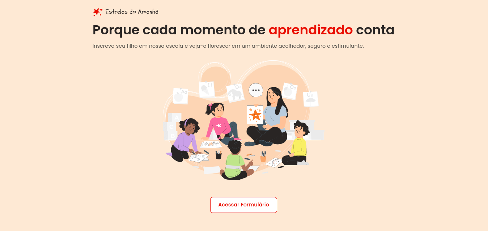

# Formulario de Matrícula - React JS

### 💻 Sobre o projeto

- Esse projeto foi desenvolvido para praticar o básico de React Js com foco na validação de formulários usando react-hook-form e yup.

- O design do projeto foi inspirado em um modelo disponível gratuitamente no Figma.

### 🎨 Layout

- A baixo o design da aplicação em execução.

1 - Tela inicial:

  

2 - Tela do formulario sendo preenchido:

  

### 🛠 Tecnologias

- As seguintes ferramentas foram usadas na construção do projeto:

- HTML
- CSS
- JAVASCRIPT (React Js, React-hook-form, yup)

### 📝 Licença

- Fique a vontade para contribuir...

- Feito com ❤️ por Irani Junior 👋🏽